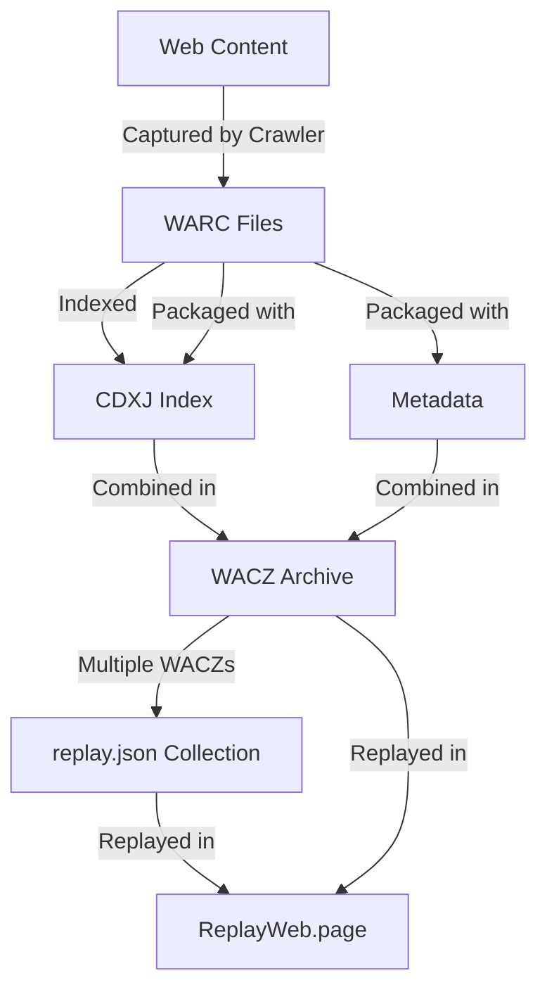
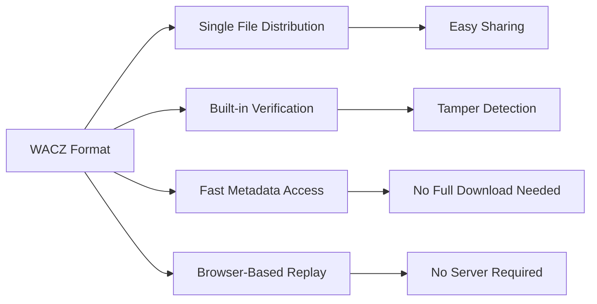
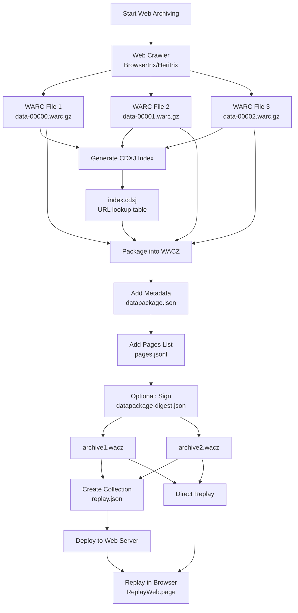
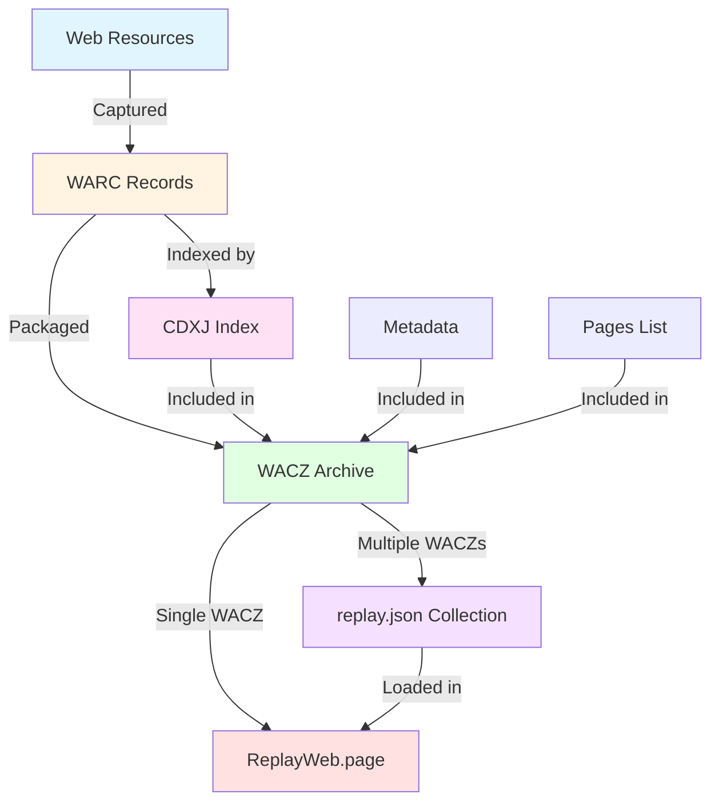
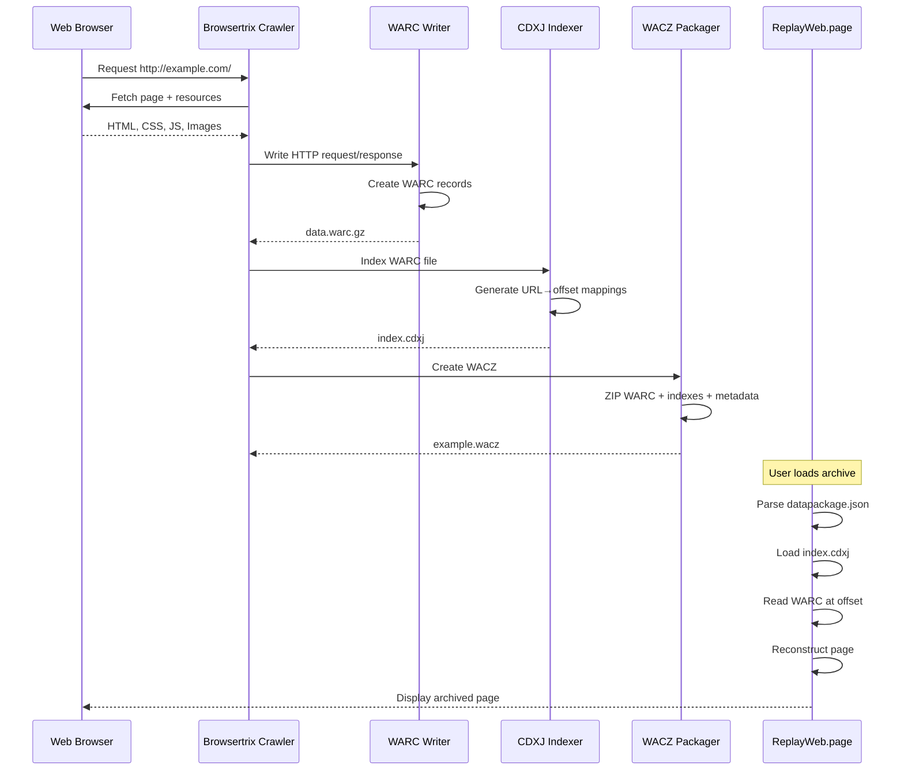

# Web Archive Formats: WARC, WACZ, and replay.json

A comprehensive guide to understanding the structure and relationships between web archive file formats used in the Webrecorder ecosystem.

## Table of Contents

1. [Overview](#overview)
2. [WARC File Format](#warc-file-format)
3. [WACZ File Format](#wacz-file-format)
4. [replay.json Collection File](#replayjson-collection-file)
5. [Relationships and Workflow](#relationships-and-workflow)
6. [Code Examples](#code-examples)
7. [References](#references)

---

## Overview

Web archiving involves capturing and preserving web content for long-term access and replay. The Webrecorder project has developed a suite of formats and tools to make web archiving accessible, portable, and verifiable:

- **WARC (Web ARChive)**: An ISO standard format for storing raw web resources
- **WACZ (Web Archive Collection Zipped)**: A packaged format containing WARCs with metadata and indexes
- **replay.json**: A collection manifest for organizing multiple WACZ files

### Key Principles



---

## WARC File Format

### What is WARC?

WARC (Web ARChive) is an **international standard (ISO 28500:2017)** for aggregating web resources captured by web archiving tools. It evolved from the earlier ARC format and is widely used by national libraries, archives, and the digital preservation community.

### Structure

A WARC file consists of a sequence of **WARC records**, where each record contains:

1. **Header Section**: Metadata fields in HTTP-like format
2. **Content Block**: The actual captured resource data
3. **Separator**: Two blank lines between records

#### WARC Record Types

| Record Type | Purpose |
|-------------|---------|
| `warcinfo` | Metadata about the WARC file itself |
| `response` | HTTP response including headers and body |
| `request` | HTTP request that was made |
| `resource` | Direct resource without protocol information |
| `metadata` | Additional metadata about other records |
| `revisit` | Indicates a duplicate resource (deduplication) |
| `conversion` | Converted resource from another format |
| `continuation` | Continuation of a truncated record |

### Example WARC Record

```
WARC/1.0
WARC-Type: response
WARC-Record-ID: <urn:uuid:12345678-1234-1234-1234-123456789012>
WARC-Date: 2025-12-10T12:00:00Z
WARC-Target-URI: http://example.com/
Content-Type: application/http; msgtype=response
Content-Length: 1234

HTTP/1.1 200 OK
Content-Type: text/html
Content-Length: 500

<!DOCTYPE html>
<html>
<head><title>Example Page</title></head>
<body><h1>Hello World</h1></body>
</html>


```

### Key Header Fields

- **WARC-Type**: The type of record (required)
- **WARC-Record-ID**: Unique identifier (UUID) for the record (required)
- **WARC-Date**: Timestamp of when the record was created (required)
- **WARC-Target-URI**: The URI of the captured resource (required for most types)
- **Content-Length**: Size of the content block in bytes (required)
- **WARC-Payload-Digest**: Hash digest of the payload for deduplication
- **WARC-Block-Digest**: Hash digest of the entire block

### Compression

WARC files are typically compressed with **gzip** (`.warc.gz`):

- Each record is usually a separate gzip member
- Allows random access without decompressing the entire file
- Enables efficient seeking to specific records
- Standard compression ratio: 60-80% depending on content

### Indexing with CDXJ

To enable fast lookup and replay, WARC files are indexed using **CDXJ (Crawl Index JSON)** format:

#### CDXJ Structure

Each line in a CDXJ file represents one archived resource:

```
<urlkey> <timestamp> <json-metadata>
```

**Example CDXJ entry:**

```json
com,example)/ 20251210120000 {"url": "http://example.com/", "mime": "text/html", "status": "200", "digest": "G7HRM7BGOKSKMSXZAHMUQTTV53QOFSMK", "length": "1234", "offset": "771", "filename": "example.warc.gz"}
```

**Fields explained:**
- `urlkey`: SURT-formatted URL for efficient sorting (`com,example)/`)
- `timestamp`: 14-digit capture time (YYYYMMDDHHmmss)
- `url`: Original URL
- `mime`: Content MIME type
- `status`: HTTP status code
- `digest`: SHA-1 hash of the content (base32 encoded)
- `length`: Length of the WARC record
- `offset`: Byte offset in the WARC file
- `filename`: Name of the WARC file containing this record

### WARC Creation Example (Pseudocode)

```python
# Using warcio library
from warcio.warcwriter import WARCWriter
from warcio.statusandheaders import StatusAndHeaders
import datetime

with open('archive.warc.gz', 'wb') as output:
    writer = WARCWriter(output, gzip=True)
    
    # Create a response record
    headers = [
        ('Content-Type', 'text/html'),
        ('Content-Length', '500')
    ]
    http_headers = StatusAndHeaders('200 OK', headers, protocol='HTTP/1.1')
    
    record = writer.create_warc_record(
        uri='http://example.com/',
        record_type='response',
        payload=b'<html>...</html>',
        http_headers=http_headers,
        warc_headers_dict={
            'WARC-Date': datetime.datetime.utcnow().isoformat() + 'Z'
        }
    )
    
    writer.write_record(record)
```

---

## WACZ File Format

### What is WACZ?

WACZ (Web Archive Collection Zipped) is a **modern packaging format** developed by Webrecorder to make web archives:

- **Portable**: Single file distribution
- **Verifiable**: Cryptographically signed and validated
- **Efficient**: Supports HTTP range requests for partial loading
- **Self-contained**: Includes all metadata, indexes, and resources

### Structure

A WACZ file is a **ZIP archive** with a specific directory layout:

```
example.wacz (ZIP file)
│
├── datapackage.json          # Main manifest (required)
├── datapackage-digest.json   # Cryptographic signature (optional)
│
├── archive/
│   ├── data-00000.warc.gz   # WARC files
│   ├── data-00001.warc.gz
│   └── data-00002.warc.gz
│
├── indexes/
│   └── index.cdxj            # CDXJ index for all WARCs
│
└── pages/
    ├── pages.jsonl           # List of pages in the archive
    └── extraPages.jsonl      # Additional curated pages
```

### datapackage.json

The core manifest file following the **Frictionless Data Package** specification:

```json
{
  "profile": "data-package",
  "name": "example-collection",
  "title": "Example Website Archive",
  "description": "Archive of example.com captured on 2025-12-10",
  "created": "2025-12-10T12:00:00Z",
  "modified": "2025-12-10T12:30:00Z",
  "wacz_version": "1.2.0",
  
  "software": "Browsertrix Crawler 1.0.0",
  "creator": {
    "name": "John Doe",
    "organization": "Example Archive Project"
  },
  
  "resources": [
    {
      "name": "archive-data",
      "path": "archive/data-00000.warc.gz",
      "hash": "sha256:abcdef1234567890...",
      "bytes": 12458392,
      "mediatype": "application/warc"
    },
    {
      "name": "index",
      "path": "indexes/index.cdxj",
      "hash": "sha256:fedcba0987654321...",
      "bytes": 245832,
      "mediatype": "application/cdxj+json"
    },
    {
      "name": "pages",
      "path": "pages/pages.jsonl",
      "hash": "sha256:1234567890abcdef...",
      "bytes": 15234,
      "mediatype": "application/jsonl"
    }
  ]
}
```

**Key fields:**
- `profile`: Must be "data-package"
- `wacz_version`: WACZ specification version
- `resources[]`: Array of all files in the archive with hashes
- `created`: ISO 8601 timestamp of creation
- `software`: Tool used to create the archive

### pages.jsonl

A JSON Lines file listing discoverable pages in the archive:

```jsonl
{"url": "http://example.com/", "title": "Example Home", "timestamp": "20251210120000", "size": 2341, "text": "Sample page content for search"}
{"url": "http://example.com/about", "title": "About Us", "timestamp": "20251210120100", "size": 1823, "text": "About page content"}
{"url": "http://example.com/contact", "title": "Contact", "timestamp": "20251210120200", "size": 982, "text": "Contact information"}
```

**Fields:**
- `url`: Full URL of the page
- `title`: Page title
- `timestamp`: Capture timestamp
- `size`: Size in bytes
- `text`: Extracted text for full-text search (optional)

### Digital Signing (Optional)

WACZ supports cryptographic verification via `datapackage-digest.json`:

```json
{
  "path": "datapackage.json",
  "hash": "sha256:9876543210fedcba...",
  "signedData": {
    "hash": "sha256:...",
    "created": "2025-12-10T12:00:00Z",
    "software": "authsign 1.0.0",
    "version": "1.0.0"
  },
  "signature": "base64-encoded-signature..."
}
```

### Creating a WACZ File (Using py-wacz)

```python
# Using py-wacz tool
from wacz.main import main as wacz_create

# Command line equivalent:
# wacz create -f data.warc.gz -o output.wacz --title "My Archive"

# Python code
import sys
sys.argv = [
    'wacz',
    'create',
    '-f', 'data.warc.gz',
    '-o', 'output.wacz',
    '--title', 'My Archive',
    '--desc', 'Archive description',
    '--pages', 'pages.jsonl'
]
wacz_create()
```

### WACZ Benefits



---

## replay.json Collection File

### What is replay.json?

`replay.json` is a **collection manifest file** that organizes multiple WACZ (or WARC) files into a single logical collection. It's used by ReplayWeb.page and other Webrecorder tools to enable seamless browsing across multiple archives.

### Use Cases

1. **Large Archives**: Split 500GB archive into multiple manageable WACZ files
2. **Curated Collections**: Combine related archives from different sources
3. **Organizational Libraries**: Present institutional web archive collections
4. **Incremental Archiving**: Add new captures to existing collections

### Structure

```json
{
  "title": "Complete Example.com Archive",
  "description": "Multi-year archive of example.com",
  "collections": [
    {
      "title": "2024 Archive",
      "filename": "example-2024.wacz",
      "source": "https://archive.example.org/example-2024.wacz",
      "loadUrl": "https://archive.example.org/example-2024.wacz",
      "size": 450000000,
      "totalSize": 450000000,
      "ctime": 1704067200000,
      "mtime": 1704067200000
    },
    {
      "title": "2025 Archive", 
      "filename": "example-2025.wacz",
      "source": "https://archive.example.org/example-2025.wacz",
      "loadUrl": "https://archive.example.org/example-2025.wacz",
      "size": 380000000,
      "totalSize": 380000000,
      "ctime": 1733875200000,
      "mtime": 1733875200000
    }
  ],
  "metadata": {
    "created": "2025-12-10T12:00:00Z",
    "creator": "Example Archive Project",
    "totalArchives": 2,
    "totalSize": 830000000
  }
}
```

### Field Descriptions

**Top-level:**
- `title`: Collection name
- `description`: Human-readable description
- `collections[]`: Array of archive files

**Collection items:**
- `title`: Name of this archive
- `filename`: Local filename
- `source`: Original source URL
- `loadUrl`: URL to load the archive from (can support range requests)
- `size`: Size in bytes
- `ctime`: Creation timestamp (Unix milliseconds)
- `mtime`: Modification timestamp (Unix milliseconds)

### Example: Browsertrix API

Browsertrix Cloud automatically generates `replay.json` endpoints:

```
https://app.browsertrix.com/api/orgs/{org-id}/collections/{coll-id}/public/replay.json
```

This allows direct replay in ReplayWeb.page:

```
https://replayweb.page/?source=https://app.browsertrix.com/api/orgs/.../replay.json
```

### Loading in ReplayWeb.page

```html
<!-- Embed a collection in a web page -->
<replay-web-page 
  source="https://example.org/replay.json"
  url="http://example.com/"
  ts="20251210120000">
</replay-web-page>
```

### Creating replay.json (Pseudocode)

```javascript
// Node.js example
const fs = require('fs');
const path = require('path');

async function createReplayJson(waczFiles, outputPath) {
  const collections = [];
  
  for (const waczPath of waczFiles) {
    const stats = await fs.promises.stat(waczPath);
    const filename = path.basename(waczPath);
    
    collections.push({
      title: filename.replace('.wacz', ''),
      filename: filename,
      source: `https://archive.example.org/${filename}`,
      loadUrl: `https://archive.example.org/${filename}`,
      size: stats.size,
      totalSize: stats.size,
      ctime: stats.ctimeMs,
      mtime: stats.mtimeMs
    });
  }
  
  const manifest = {
    title: "My Archive Collection",
    description: "Collection of web archives",
    collections: collections,
    metadata: {
      created: new Date().toISOString(),
      totalArchives: collections.length,
      totalSize: collections.reduce((sum, c) => sum + c.size, 0)
    }
  };
  
  await fs.promises.writeFile(
    outputPath, 
    JSON.stringify(manifest, null, 2)
  );
}

// Usage
createReplayJson(
  ['archive1.wacz', 'archive2.wacz'],
  'replay.json'
);
```

---

## Relationships and Workflow

### Complete Web Archiving Workflow



### Format Hierarchy



### Data Flow Example

Let's trace a single web page through the system:



### File Size Comparison

Typical file sizes for archiving a medium website (1000 pages):

| Format | Size | Notes |
|--------|------|-------|
| Original Web Content | ~500 MB | HTML, CSS, JS, images |
| WARC (uncompressed) | ~520 MB | Includes HTTP headers |
| WARC (gzipped) | ~180 MB | 65% compression |
| CDXJ Index | ~2 MB | Small, fast lookups |
| pages.jsonl | ~150 KB | Metadata only |
| WACZ (complete) | ~183 MB | All above + manifest |
| replay.json | ~2 KB | Just references |

---

## Code Examples

### Example 1: Reading a WARC File

```python
from warcio.archiveiterator import ArchiveIterator

with open('archive.warc.gz', 'rb') as stream:
    for record in ArchiveIterator(stream):
        if record.rec_type == 'response':
            url = record.rec_headers.get_header('WARC-Target-URI')
            date = record.rec_headers.get_header('WARC-Date')
            
            # Get HTTP headers
            http_status = record.http_headers.get_statuscode()
            content_type = record.http_headers.get_header('Content-Type')
            
            # Read payload
            payload = record.content_stream().read()
            
            print(f"URL: {url}")
            print(f"Date: {date}")
            print(f"Status: {http_status}")
            print(f"Type: {content_type}")
            print(f"Size: {len(payload)} bytes")
            print("---")
```

### Example 2: Querying a CDXJ Index

```python
import json

def find_captures(cdxj_file, url):
    """Find all captures of a URL in a CDXJ index"""
    captures = []
    
    with open(cdxj_file, 'r') as f:
        for line in f:
            # Parse CDXJ line: urlkey timestamp json
            parts = line.strip().split(' ', 2)
            if len(parts) == 3:
                urlkey, timestamp, json_data = parts
                data = json.loads(json_data)
                
                if data.get('url') == url:
                    captures.append({
                        'timestamp': timestamp,
                        'status': data.get('status'),
                        'mime': data.get('mime'),
                        'filename': data.get('filename'),
                        'offset': data.get('offset'),
                        'length': data.get('length')
                    })
    
    return captures

# Usage
results = find_captures('index.cdxj', 'http://example.com/')
for capture in results:
    print(f"Captured at: {capture['timestamp']}")
    print(f"Status: {capture['status']}")
    print(f"Location: {capture['filename']} @ {capture['offset']}")
```

### Example 3: Extracting from WACZ

```python
import zipfile
import json

def explore_wacz(wacz_path):
    """Explore the contents of a WACZ file"""
    with zipfile.ZipFile(wacz_path, 'r') as zf:
        # Read manifest
        with zf.open('datapackage.json') as f:
            manifest = json.load(f)
        
        print(f"Archive: {manifest.get('title')}")
        print(f"Created: {manifest.get('created')}")
        print(f"WACZ Version: {manifest.get('wacz_version')}")
        print("\nResources:")
        
        for resource in manifest.get('resources', []):
            print(f"  - {resource['path']}")
            print(f"    Size: {resource.get('bytes', 0):,} bytes")
            print(f"    Hash: {resource.get('hash', 'N/A')[:20]}...")
        
        # List pages
        if 'pages/pages.jsonl' in zf.namelist():
            with zf.open('pages/pages.jsonl') as f:
                pages = [json.loads(line) for line in f]
                print(f"\nTotal pages: {len(pages)}")
                print("\nFirst 5 pages:")
                for page in pages[:5]:
                    print(f"  - {page.get('url')}")
                    print(f"    Title: {page.get('title')}")

# Usage
explore_wacz('example.wacz')
```

### Example 4: Validating WACZ Integrity

```python
import zipfile
import json
import hashlib

def verify_wacz(wacz_path):
    """Verify WACZ file integrity using hashes"""
    with zipfile.ZipFile(wacz_path, 'r') as zf:
        # Read manifest
        with zf.open('datapackage.json') as f:
            manifest = json.load(f)
        
        print("Verifying WACZ integrity...")
        all_valid = True
        
        for resource in manifest.get('resources', []):
            path = resource['path']
            expected_hash = resource.get('hash', '')
            
            if not expected_hash:
                continue
            
            # Extract algorithm and hash
            algo, expected = expected_hash.split(':', 1)
            
            # Calculate actual hash
            with zf.open(path) as f:
                hasher = hashlib.new(algo)
                hasher.update(f.read())
                actual = hasher.hexdigest()
            
            if actual == expected:
                print(f"✓ {path}: OK")
            else:
                print(f"✗ {path}: FAILED")
                all_valid = False
        
        if all_valid:
            print("\n✓ All files verified successfully!")
        else:
            print("\n✗ Verification failed!")
        
        return all_valid

# Usage
verify_wacz('example.wacz')
```

### Example 5: Creating a Simple Web Archive

```python
from warcio.warcwriter import WARCWriter
from warcio.statusandheaders import StatusAndHeaders
import requests
import datetime
import gzip

def archive_url(url, output_file):
    """Archive a single URL to a WARC file"""
    
    # Fetch the URL
    response = requests.get(url)
    
    with gzip.open(output_file, 'wb') as output:
        writer = WARCWriter(output, gzip=False)  # Already gzipped
        
        # Create request record
        req_headers = StatusAndHeaders(
            f'GET {url} HTTP/1.1',
            [('Host', requests.utils.urlparse(url).netloc)],
            protocol='HTTP/1.1'
        )
        
        request_record = writer.create_warc_record(
            uri=url,
            record_type='request',
            http_headers=req_headers
        )
        writer.write_record(request_record)
        
        # Create response record
        resp_headers = StatusAndHeaders(
            f'{response.status_code} {response.reason}',
            list(response.headers.items()),
            protocol='HTTP/1.1'
        )
        
        response_record = writer.create_warc_record(
            uri=url,
            record_type='response',
            payload=response.content,
            http_headers=resp_headers,
            warc_headers_dict={
                'WARC-Date': datetime.datetime.utcnow().isoformat() + 'Z'
            }
        )
        writer.write_record(response_record)
    
    print(f"Archived {url} to {output_file}")

# Usage
archive_url('http://example.com/', 'example.warc.gz')
```

---

## References

### Official Specifications

1. **WARC Format**
   - ISO 28500:2017 Standard: https://iipc.github.io/warc-specifications/
   - Library of Congress: https://www.loc.gov/preservation/digital/formats/fdd/fdd000236.shtml

2. **WACZ Format**
   - Latest Specification: https://specs.webrecorder.net/wacz/latest/
   - Version 1.2.0: https://specs.webrecorder.net/wacz/1.2.0/
   - Library of Congress: https://www.loc.gov/preservation/digital/formats/fdd/fdd000586.shtml

3. **CDXJ Format**
   - Specification: https://specs.webrecorder.net/cdxj/0.1.0/

4. **Webrecorder Specifications**
   - Main Documentation: https://specs.webrecorder.net/
   - GitHub Repository: https://github.com/webrecorder/specs

### Key Repositories

1. **webrecorder/specs**
   - https://github.com/webrecorder/specs
   - All format specifications and documentation

2. **webrecorder/wabac.js**
   - https://github.com/webrecorder/wabac.js
   - JavaScript library for web archive replay

3. **webrecorder/warcio.js**
   - https://github.com/webrecorder/warcio.js
   - JavaScript WARC reader/writer

4. **webrecorder/replayweb.page**
   - https://github.com/webrecorder/replayweb.page
   - Browser-based archive replay tool
   - Documentation: https://replayweb.page/docs/

5. **webrecorder/browsertrix-crawler**
   - https://github.com/webrecorder/browsertrix-crawler
   - High-fidelity browser-based crawler

6. **webrecorder/browsertrix**
   - https://github.com/webrecorder/browsertrix
   - Complete web archiving platform

7. **webrecorder/py-wacz**
   - https://github.com/webrecorder/py-wacz
   - Python tools for creating and validating WACZ files

8. **webrecorder/pywb**
   - https://github.com/webrecorder/pywb
   - Python web archive replay system
   - Documentation: https://pywb.readthedocs.io/

9. **webrecorder/cdxj-indexer**
   - https://github.com/webrecorder/cdxj-indexer
   - CDXJ indexing tool for WARC files

### Tools and Libraries

#### Python
- **warcio**: WARC reading/writing
- **py-wacz**: WACZ creation and validation
- **cdxj-indexer**: CDXJ index generation
- **pywb**: Web archive replay framework

#### JavaScript/Node.js
- **warcio.js**: WARC processing
- **wabac.js**: Archive replay engine
- **replayweb.page**: Browser-based replay

#### Command Line
- **browsertrix-crawler**: Docker-based crawling
- **wacz**: WACZ CLI tool (from py-wacz)
- **wb-manager**: Collection management

### Community Resources

1. **Webrecorder Blog**
   - https://webrecorder.net/blog/

2. **Webrecorder Forum**
   - https://forum.webrecorder.net/

3. **Archive Team Wiki**
   - https://wiki.archiveteam.org/
   - WARC Ecosystem: https://wiki.archiveteam.org/index.php/The_WARC_Ecosystem

4. **International Internet Preservation Consortium (IIPC)**
   - https://netpreserve.org/

### Additional Learning Resources

1. **ReplayWeb.page User Guide**
   - https://replayweb.page/docs/user-guide/
   - Embedding documentation: https://replayweb.page/docs/embedding/

2. **Browsertrix Documentation**
   - User guide and API documentation

3. **WARC Specification Annotated**
   - Detailed field-by-field explanation

---

## Quick Reference

### File Extensions

| Extension | Description |
|-----------|-------------|
| `.warc` | Uncompressed WARC file |
| `.warc.gz` | Gzipped WARC file (most common) |
| `.wacz` | WACZ archive (ZIP format) |
| `.cdxj` | CDXJ index file |
| `.jsonl` | JSON Lines (one JSON object per line) |

### MIME Types

| Format | MIME Type |
|--------|-----------|
| WARC | `application/warc` |
| WACZ | `application/wacz` or `application/zip` |
| CDXJ | `application/cdxj+json` |
| JSONL | `application/jsonl` or `application/x-ndjson` |

### Common Commands

```bash
# Create WACZ from WARC files
wacz create -f input.warc.gz -o output.wacz --pages pages.jsonl

# Validate WACZ file
wacz validate output.wacz

# Index WARC file to CDXJ
cdxj-indexer input.warc.gz > index.cdxj

# Extract WACZ contents
unzip output.wacz -d extracted/

# Serve archive for replay
wb-manager serve output.wacz

# Crawl and create WACZ
docker run -v $PWD:/crawls webrecorder/browsertrix-crawler \
  crawl --url https://example.com --output /crawls/example.wacz
```

---

## Conclusion

The Webrecorder ecosystem provides a comprehensive suite of formats and tools for web archiving:

- **WARC** provides the foundational storage format (ISO standard)
- **WACZ** packages archives with metadata for easy distribution
- **replay.json** organizes multiple archives into collections
- **CDXJ** enables fast lookups and efficient replay

Together, these formats enable:
- ✓ Long-term preservation (ISO standard)
- ✓ Decentralized archiving (self-contained files)
- ✓ Browser-based replay (no server needed)
- ✓ Cryptographic verification (signed archives)
- ✓ Efficient access (indexed, compressed)

For implementation details, always refer to the official specifications and the active Webrecorder repositories for the latest updates and best practices.

---

*This guide was created based on specifications and documentation from the Webrecorder project and related standards. For the most up-to-date information, consult the official repositories and documentation.*

*Last updated: December 2025*
